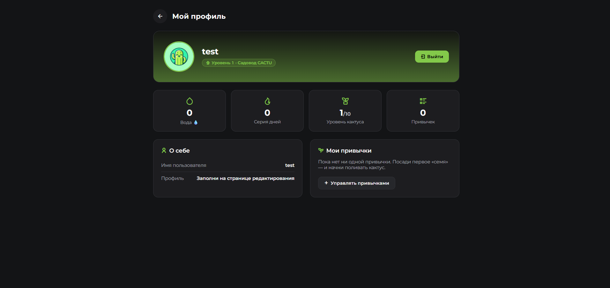
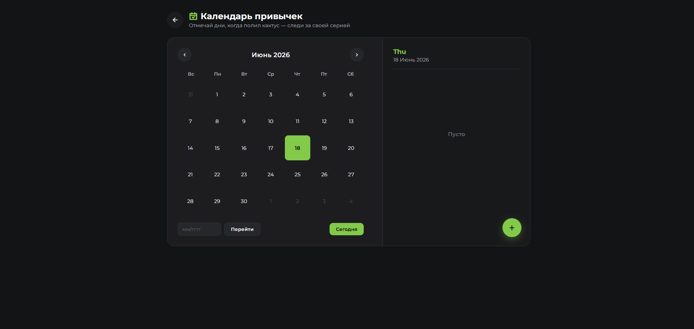

<div align="center">

# 🌵 CACTU — геймифицированный трекер привычек

**Поливай кактус привычками. Растёшь ты — растёт растение.**

[](https://openjdk.org/)
[](https://spring.io/projects/spring-boot)
[](https://www.postgresql.org/)
[](https://www.thymeleaf.org/)
[](https://maven.apache.org/)

</div>

---

## 💡 Идея

Большинство трекеров привычек скучные — список галочек, который быстро надоедает.
**CACTU** превращает дисциплину в игру:

> Выполняешь привычку → получаешь **воду** 💧 → поливаешь кактус → он растёт.
> Пропускаешь дни → серия обнуляется, кактус начинает увядать.

Чем дольше держишь серию, тем выше уровень растения (от ростка до цветущего кактуса) и тем больше воды можно потратить на новые **облики** питомца. Тот же принцип, что в *Forest* и *Habitica* — внешняя мотивация через прогресс и заботу о персонаже.

---

## 📸 Скриншоты

| Главная | Профиль |
|:---:|:---:|
|  |  |
| **Календарь** | **Вход** |
|  |  |

---

## ✨ Возможности

- 🔐 **Регистрация и вход** — Spring Security, форма логина, шифрование паролей `BCrypt`, защита CSRF
- 🌱 **Привычки** — создание, редактирование, удаление, группировка по категориям
- ✅ **Ежедневные отметки** — трекер выполнения по дням (`PracticeTracker`)
- 📊 **Живой профиль** — реальная статистика из БД: вода, серия дней, уровень кактуса, количество привычек
- 📅 **Календарь** — визуализация активности по дням
- 🛍️ **Облики кактуса** — кастомизация персонажа за накопленную воду
- 👤 **Роли** — разделение прав `admin` / `user`, отдельная админ-панель

---

## 🛠️ Технологии

| Слой | Технологии |
|------|-----------|
| **Backend** | Java 17, Spring Boot 3.2.3, Spring Security, Spring Data JPA / Hibernate |
| **Frontend** | Thymeleaf, HTML5, CSS3 (кастомный дизайн-токены), Remix Icons |
| **База данных** | PostgreSQL 16 |
| **Сборка** | Maven (wrapper `mvnw`) |
| **Архитектура** | MVC: `controller` → `service` → `repository` → `model` |

---

## 🚀 Запуск локально

### Требования
- JDK 17
- PostgreSQL 16
- Maven (входит в проект как `mvnw`)

### Шаги

**1. Создай базу данных и схему:**
```sql
CREATE DATABASE habits_db;
\c habits_db
CREATE SCHEMA IF NOT EXISTS habits_corp;
```

**2. Настрой локальный пароль БД.**
Скопируй пример и впиши свой пароль PostgreSQL:
```bash
cp application-local.properties.example application-local.properties
```
```properties
# application-local.properties (этот файл в .gitignore и НЕ попадёт в git)
spring.datasource.password=твой_пароль
```

> При необходимости остальные параметры подключения переопределяются переменными окружения:
> `PGHOST`, `PGPORT`, `PGDATABASE`, `PGUSER`, `PGPASSWORD`.

**3. Запусти приложение:**
```powershell
# Windows / PowerShell
$env:JAVA_HOME = "C:\Program Files\Java\jdk-17"
.\mvnw spring-boot:run
```
```bash
# Linux / macOS
JAVA_HOME=/path/to/jdk-17 ./mvnw spring-boot:run
```

**4. Открой** [http://localhost:8080](http://localhost:8080)

Зарегистрируй аккаунт на `/register`, войди — и начинай поливать кактус 🌵

---

## 📁 Структура проекта

```
src/main/
├── java/com/habits/habits/
│   ├── config/         # Spring Security, BCrypt, UserDetails
│   ├── controller/     # Dashboard, Habit, Profile, Admin, Category, Feedback
│   ├── model/          # User, Habit, PracticeTracker, UserProfile, Category, Role
│   ├── repository/     # Spring Data JPA репозитории
│   ├── service/        # Бизнес-логика
│   └── exception/      # Кастомные исключения
└── resources/
    ├── templates/      # Thymeleaf-страницы (home, login, calendar, profile…)
    ├── static/         # CSS, JS, изображения
    └── application.properties
```

---

## 🔖 Версии

В репозитории есть теги, показывающие эволюцию проекта:

| Тег | Описание |
|-----|----------|
| `v1-broken` | Исходная версия с багами (битые пути, нерабочий вход, заглушки) |
| `v2-fixed` | Рабочая версия: починен вход, переработан дизайн, живые данные профиля, секреты вынесены из репозитория |

```bash
git checkout v1-broken   # посмотреть «как было»
git checkout main        # вернуться к актуальной версии
```

---

## 🔒 Безопасность

- Пароли пользователей хранятся в виде `BCrypt`-хэшей
- Защита от CSRF включена для всех изменяющих запросов
- Секреты (пароль БД) вынесены в `application-local.properties` и **не коммитятся** в git

---

## 👨‍💻 Автор

**Ақжан** (Akzhan) — разработано как pet-проект для портфолио.

- 🌍 Астана, Казахстан
- 💻 GitHub: [@MOLIBDEN79](https://github.com/MOLIBDEN79)
- 📫 Email: akjan601@gmail.com

---

<div align="center">
<sub>Поливай кактус привычками каждый день 🌵💧</sub>
</div>
